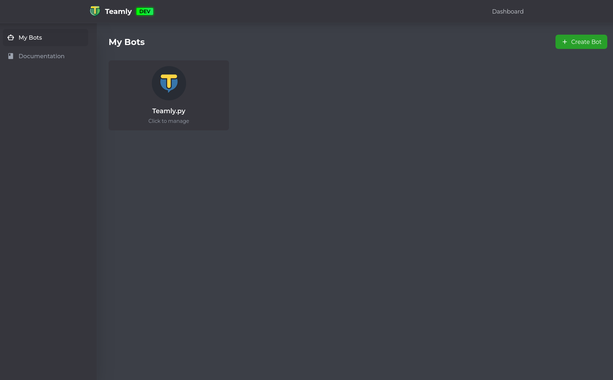
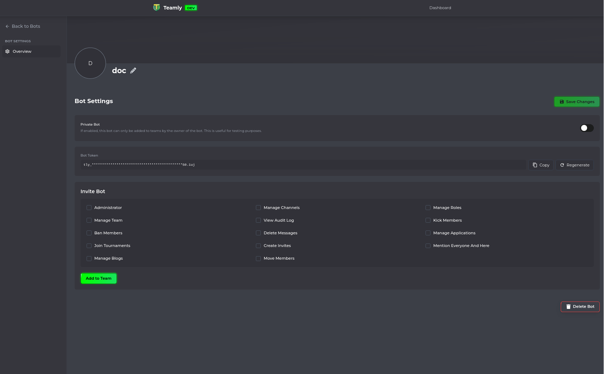
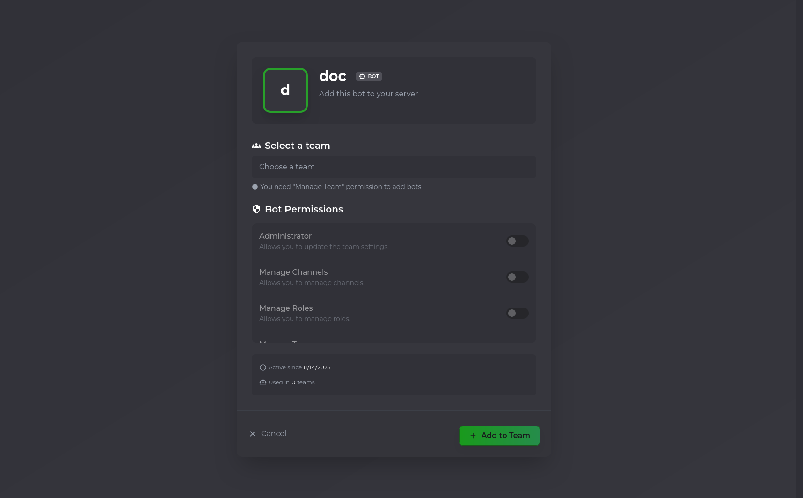
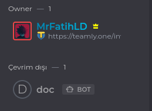

# Create your teamly bot

---

First, we need to create a bot for [teamly.one](https://teamly.one).

Go to the [Teamly Developer](https://teamly.one/developers) site to create your bot.

When you open the **My Bots** page, it will be empty if you haven’t created any bots yet.
Click the **Create Bot** button in the upper-right corner to start creating your bot.

---

After entering your bot's name. You will redirect to your bot's panel:

In this panel, you can configure all settings for your bot. You can:

- Change the **profile picture**
- Edit the bot’s **name**
- Toggle between **private** and **public** mode
- Regenerate your API **token** if needed
- Adjust your bot’s **permissions**

!!! note "Note"
    The permissions you select here are **not** directly assigned to the bot.
    Instead, they will appear as **pre-selected** in the bot’s invite link.
    The person inviting the bot to a team will have the final choice on which permissions to grant.

---

Let’s invite the bot to our **team** (in Teamly, a *team* is similar to a *guild*)..

> **Info:** You need the **"Manage Team"** permission to add bots to a team.

In this section, choose the team where you want to add the bot.
After selecting the team, you can configure the bot’s permissions for that team.

!!! note "Important"
    The **Bot Permissions** section currently has a bug — some permissions, such as **"Kick Members"**, cannot be selected here.
    However, you can still adjust the bot’s permissions later from the team’s permission settings.

---

After the invite you will see your bot in members list at the right corner:

{ style="display:block;margin:0 auto;max-width:100%;height:auto" }
